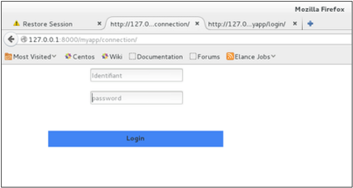
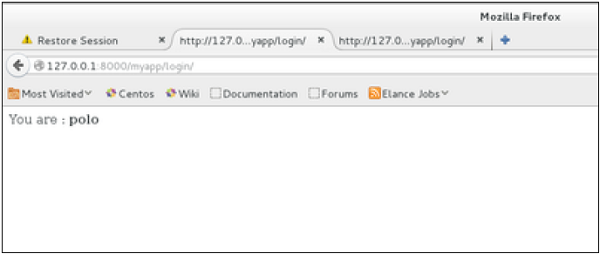

## Cookies Handling

মনে করুন আপনি Amazon, Alibaba এর মতো কোন E-Commerce সাইটে গেলেন, তো এইসব সাইট আপনার ইন্টারনেট ব্রাউজারে তাদের প্রয়োজনীয় cookies বসিয়ে দেবে। এখন এই cookies বসানোর পরে আপনি সেই সাইট গুলোতে গিয়ে কি কি প্রোডাক্ট বা প্লেস সার্চ করলেন বা কোন আইটেম বেশি সময় ধরে দেখলেন আর কোন আইটেম কম সময় ধরে, এই সমস্ত ডাটা গুলো আপনার ইন্টারনেট ব্রাউজার কুকিজের মাধ্যমে সেই ওয়েবসাইট টির কাছে লাগাতার পাঠাতে থাকে। যাতে আপনি যদি পরবর্তীতে সেই ওয়েবসাইটে প্রবেশ করেন তবে সেই ওয়েবসাইট টি আপনাকে রেকমেন্ড রেজাল্ট দেখাতে পারে। এছাড়াও সংশ্লিষ্ট ওয়েব সাইট গুলো google, facebook এর মতো ads flatform এর মাধ্যমে আপনাকে আপনার পছন্দনীয় আইটেমের ads প্রদর্শন করতে পারবে। মনে করুন আপনি গতবার অ্যামাজনে একটি ব্র্যান্ডের ঘড়ি সার্চ করেছিলেন এবং কুকিজের মাধ্যমে সেই ডাটা গুলো অ্যামাজনের কাছে চলে গেছে, এবার এখন যদি আবার অ্যামাজন ভিসিট করেন অথবা গুগল এ সার্চ করেন তবে আপনাকে আরো ঐরকম ঘড়ি দেখানো হবে আপনাকে একই দাম রেঞ্জের আরো প্রোডাক্ট দেখানো হবে।

### Always keep in mind, that cookies are saved on the client side and depending on your client browser security level, setting cookies can at times work and at times might not.

To illustrate cookies handling in Django, let's create a system using the login system we created before. The system will keep you logged in for X minute of time, and beyond that time, you will be out of the app.

For this, you will need to set up two cookies, last_connection and username.

At first, let's change our login view to store our username and last_connection cookies −

```python
>>> from django.template import RequestContext

>>> def login(request):
...   username = "not logged in"
   
...   if request.method == "POST":
...      #Get the posted form
...      MyLoginForm = LoginForm(request.POST)
   
...   if MyLoginForm.is_valid():
...      username = MyLoginForm.cleaned_data['username']
...   else:
...      MyLoginForm = LoginForm()
   
...   response = render_to_response(request, 'loggedin.html', {"username" : username}, 
...      context_instance = RequestContext(request))
   
...   response.set_cookie('last_connection', datetime.datetime.now())
...   response.set_cookie('username', datetime.datetime.now())
	
...   return response
```

As seen in the view above, setting cookie is done by the set_cookie method called on the response not the request, and also note that all cookies values are returned as string.

Let’s now create a formView for the login form, where we won’t display the form if cookie is set and is not older than 10 second −

```python
>>> def formView(request):
...   if 'username' in request.COOKIES and 'last_connection' in request.COOKIES:
...      username = request.COOKIES['username']
      
...      last_connection = request.COOKIES['last_connection']
...      last_connection_time = datetime.datetime.strptime(last_connection[:-7], "%Y-%m-%d %H:%M:%S")
      
...      if (datetime.datetime.now() - last_connection_time).seconds < 10:
...         return render(request, 'loggedin.html', {"username" : username})
...      else:
...         return render(request, 'login.html', {})
			
...   else:
...      return render(request, 'login.html', {})

```
As you can see in the formView above accessing the cookie you set, is done via the COOKIES attribute (dict) of the request.

Now let’s change the url.py file to change the URL so it pairs with our new view −

```python
>>> from django.conf.urls import patterns, url
>>> from django.views.generic import TemplateView

>>> urlpatterns = patterns('myapp.views',
...   url(r'^connection/','formView', name = 'loginform'),
...   url(r'^login/', 'login', name = 'login'))

```

When accessing /myapp/connection, you will get the following page −


And you will get redirected to the following screen on submit −


Now, if you try to access /myapp/connection again in the 10 seconds range, you will get redirected to the second screen directly. And if you access /myapp/connection again out of this range you will get the login form (screen 1).

> Source - w3programmers & tutorialspoint
