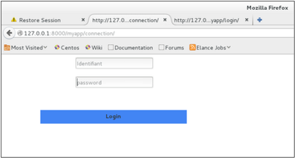
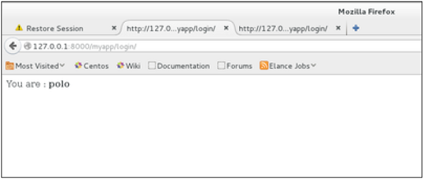
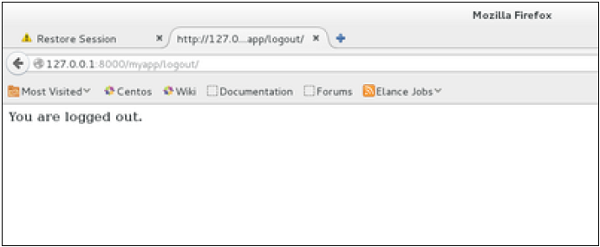

# Django - Session

Session হচ্ছে ইউজার এর তথ্য অস্থায়ীভাবে Server এ সংরক্ষণ এবং Server এর মধ্যে অবস্থিত এক Page থেকে আরেকটি Page এ পাস করার মাধ্যম। (যতক্ষণ না ব্যবহারকারী ব্রাউজার বন্ধ করে দেয়)। একটি session based environment এ প্রত্যেক ইউজার কে একটি ইউনিক নম্বর দিয়ে identify করা হয়। যেটাকে বলা হয় session identifier অথবা SID. এই unique session ID টি প্রতিটি ব্যবহারকারীকে তাদের নিজস্ব তথ্য ইমেল, পোস্ট, ইত্যাদি সার্ভারের সাথে যোগাযোগ করতে ব্যবহার করা হয়।

## কেন এবং কখন Session ব্যবহার করবেন?
 * আপনি যদি আপনার ওয়েব সাইটের ব্যবহার কারীর গুরুত্বপূর্ণ তথ্য যেমন Id, Password ইত্যাদি আরও সুরক্ষিতভাবে সংরক্ষণ করতে চান যেন   Malicious ব্যবহার কারীরা সেই তথ্য কোনো ভাবে টেম্পার করতে না পারে।
 * আপনি যদি আপনার সার্ভারের এক পেজ থেকে অন্য পেজ এ value পাস করতে চান।
 * আপনি ব্রাউজারে cookies এর বিকল্প চান। অর্থাৎ যদি ব্রাউজার cookie সমর্থন না করে।
 * আপনি global ভেরিয়েবলগুলি কে URL- এ পাস করার তুলনায় একটি কার্যকর এবং আরো নিরাপদ পদ্ধতিতে সংরক্ষণ করতে চাইছেন।
 * আপনি চাচ্ছেন ব্যবহারকারী ব্রাউজার বন্ধ করার সাথে সাথে তার সার্ভারে সংরক্ষিত সব তথ্য ডিলিট করে দিতে।

### Setting Up Sessions

In Django, enabling session is done in your project settings.py, by adding some lines to the MIDDLEWARE_CLASSES and the INSTALLED_APPS options. This should be done while creating the project, but it's always good to know, so MIDDLEWARE_CLASSES should have −

```python
'django.contrib.sessions.middleware.SessionMiddleware'
```

And INSTALLED_APPS should have −
```python
'django.contrib.sessions'
```

Let's create a simple sample to see how to create and save sessions. 
For this, first lets change our login view to save our username cookie server side −
```python
>>> def login(request):
...   username = 'not logged in'
   
...   if request.method == 'POST':
...      MyLoginForm = LoginForm(request.POST)
      
...      if MyLoginForm.is_valid():
...         username = MyLoginForm.cleaned_data['username']
...         request.session['username'] = username
...      else:
...         MyLoginForm = LoginForm()
			
...   return render(request, 'loggedin.html', {"username" : username}

```

Then let us create formView view for the login form, where we won’t display the form if cookie is set −
```python
>>> def formView(request):
...   if request.session.has_key('username'):
...      username = request.session['username']
...      return render(request, 'loggedin.html', {"username" : username})
...   else:
...      return render(request, 'login.html', {})

```
Now let us change the url.py file to change the url so it pairs with our new view −

```python
>>> from django.conf.urls import patterns, url
>>> from django.views.generic import TemplateView

>>> urlpatterns = patterns('myapp.views',
...   url(r'^connection/','formView', name = 'loginform'),
...   url(r'^login/', 'login', name = 'login'))

```

When accessing /myapp/connection, you will get to see the following page −
 
And you will get redirected to the following page −
 

Now if you try to access /myapp/connection again, you will get redirected to the second screen directly.
Let's create a simple logout view that erases our cookie.
```python
>>> def logout(request):
...   try:
...      del request.session['username']
...   except:
...      pass
...   return HttpResponse("<strong>You are logged out.</strong>")
```

And pair it with a logout URL in myapp/url.py
```python
url(r'^logout/', 'logout', name = 'logout'),
```
Now, if you access /myapp/logout, you will get the following page −
 

If you access /myapp/connection again, you will get the login form (screen 1).

### Some More Possible Actions Using Sessions
We have seen how to store and access a session, but it's good to know that the session attribute of the request have some other useful actions like −

 * set_expiry (value) − Sets the expiration time for the session.

 * get_expiry_age() − Returns the number of seconds until this session expires.

 * get_expiry_date() − Returns the date this session will expire.

 * clear_expired() − Removes expired sessions from the session store.

 * get_expire_at_browser_close() − Returns either True or False, depending on whether the user’s session cookies have expired when the user’s web browser is closed.

> Source - w3programmers & tutorialspoint
